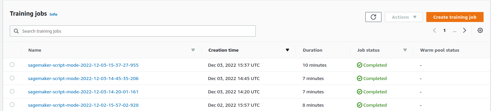
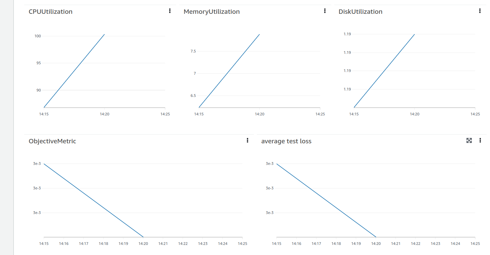
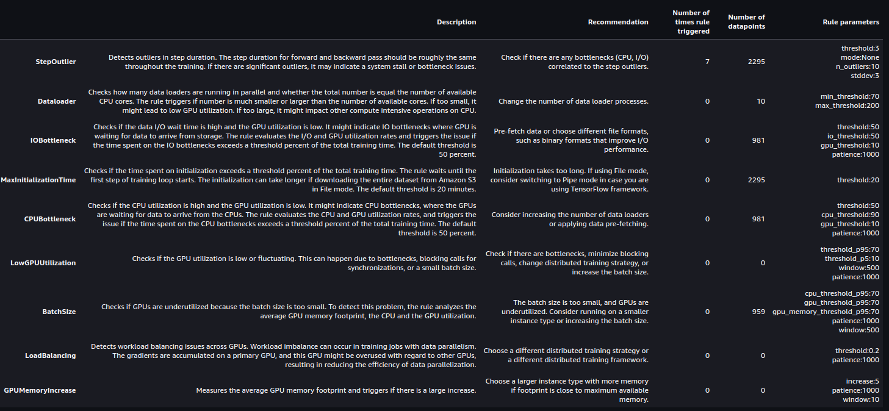
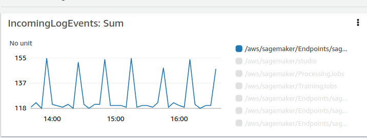

# Image Classification using AWS SageMaker

In this project I have used the pretrained resnet18 model I have added one layer and I have used it on the cifar10 dataset using aws sagemaker studio to get fast and deployed model.
## Project Set Up and Installation
In order to create this project I have cloned this repositiry  https://github.com/udacity/CD0387-deep-learning-topics-within-computer-vision-nlp-project-starter.git and I have used the aws pytorch 1.8, python 3.6 kernel and the aws ml.m5.large instance to help me run all the nessecary code.
In addition to that I have installed the smdebug library using pip as follows:
!pip install smdebug

## Dataset
I am using the cifar10 dataset and here is a small description of it: 
The CIFAR-10 dataset consists of 60000 32x32 colour images in 10 classes, with 6000 images per class. There are 50000 training images and 10000 test images.

The dataset is divided into five training batches and one test batch, each with 10000 images. The test batch contains exactly 1000 randomly-selected images from each class. The training batches contain the remaining images in random order, but some training batches may contain more images from one class than another. Between them, the training batches contain exactly 5000 images from each class.
### Model used
ResNet18 is a 72-layer architecture with 18 deep layers. The architecture of this network aimed at enabling large amounts of convolutional layers to function efficiently. However, the addition of multiple deep layers to a network often results in a degradation of the output. This is known as the problem of vanishing gradient where neural networks, while getting trained through back propagation, rely on the gradient descent, descending the loss function to find the minimizing weights. Due to the presence of multiple layers, the repeated multiplication results in the gradient becoming smaller and smaller thereby “vanishing” leading to a saturation in the network performance or even degrading the performance.

The primary idea of ResNet is the use of jumping connections that are mostly referred to as shortcut connections or identity connections. These connections primarily function by hopping over one or multiple layers forming shortcuts between these layers. The aim of introducing these shortcut connections was to resolve the predominant issue of vanishing gradient faced by deep networks. These shortcut connections remove the vanishing gradient issue by again using the activations of the previous layer. These identity mappings initially do not do anything much except skip the connections, resulting in the use of previous layer activations. This process of skipping the connection compresses the network; hence, the network learns faster. This compression of the connections is followed by expansion of the layers so that the residual part of the network could also train and explore more feature space. The input size to the network is 224 × 224 × 3, which is predefined. The network is considered to be a DAG network due to its complex layered architecture and because the layers have input from multiple layers and give output to multiple layers. Residual networks and their variants have broadly been implemented for the analysis of medical images [22, 27–29]. Fig. 4.5 shows the layer architecture of ResNet18 CNN model.

## Hyperparameter Tuning
In this project I have tuned 3 hyperparameters which are:
{
    "lr": ContinuousParameter(0.001, 0.1),
    "batch-size": CategoricalParameter([32, 64, 128, 256, 512]),
    "epochs": IntegerParameter(2, 4)
}

Remember that your README should:
- Include a screenshot of completed training jobs
- Logs metrics during the training process
- Tune at least two hyperparameters
- Retrieve the best best hyperparameters from all your training jobs

## Debugging and Profiling
I have used the smdebug library to do the profiling and the debugging.
all of my debugging and profiling are included in the profiler-report.ipynb and the profiler-report.html files but here is a short summary:

## Model Deployment
I have deployed the model using the deploy function:

`
predictor=estimator.deploy(initial_instance_count=1, instance_type="ml.m5.large")  
`

you can use this function to prepare the input for the model:

`
file = "data/cifar-10-batches-py/data_batch_1"
def unpickle(file):
    import pickle
    with open(file, 'rb') as fo:
        Data = pickle.load(fo, encoding='bytes')
    return Data

Data_extracted=unpickle(file)
data=np.reshape(Data_extracted[b'data'][0], (3, 32, 32))
`

